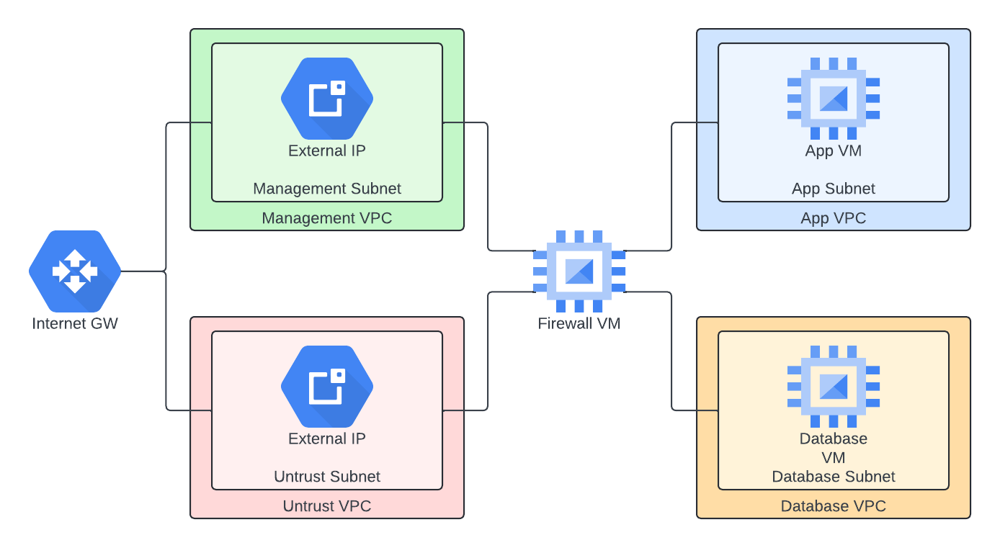
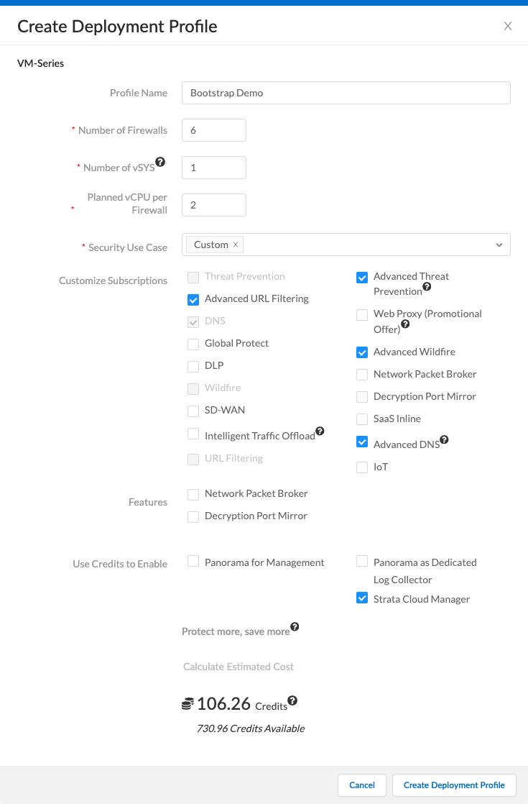
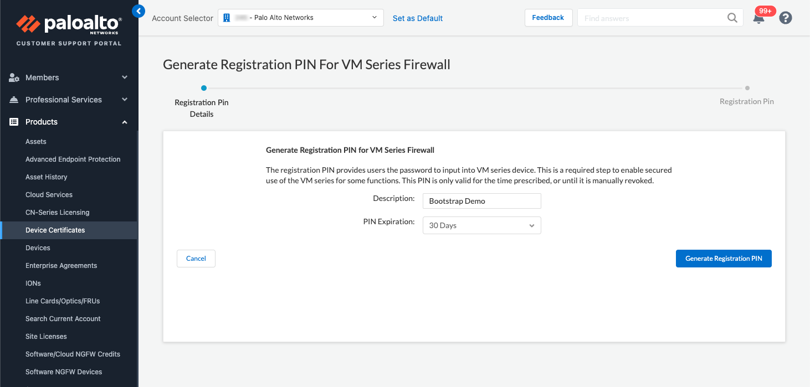
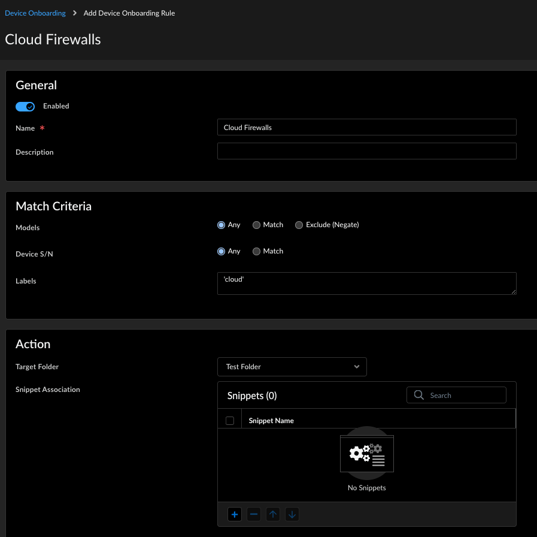
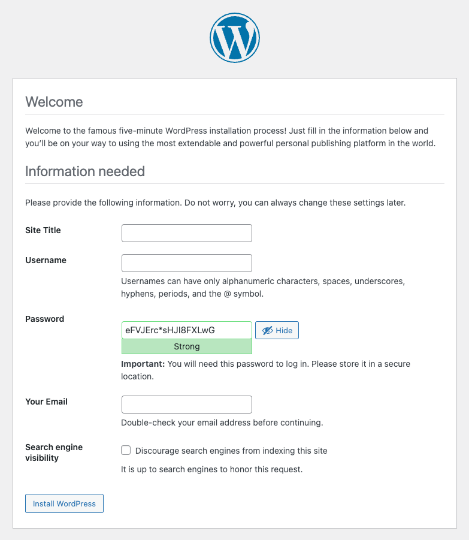

# terraform-scm-bootstrap

This Terraform plan demostrates an orchestrated deployment of a multi-tiered web application protected by a Palo Alto Networks VM-Series firewall in the Google Cloud Platform.

## Topology
The deployment consists of a the following resources
- 4 VPCs and subnets
- 2 private routes
- 4 ephermal private IP address
- 2 external IP addresses
- 1 application server VM (WordPress)
- 1 database server VM (MariaDB)
- 1 firewall VM



## Requirements
- Strata Cloud Manager tenant and device label
- VM-Flex credits and deployment profile
- Certificate request PIN ID and value
- GCP project with Compute API enabled
- GCP service account credentials

## Preparation

### Google Cloud Platform

1. Enable the Compute Engine API within the GCP project.


2. [Create a service account](https://cloud.google.com/iam/docs/service-accounts-create) and assign it Editor permissions.
3. [Create a key](https://cloud.google.com/iam/docs/keys-create-delete) for the service account and export the key in JSON format.

### Palo Alto Networks Support Portal

1. [Create a Deployment Profile](https://docs.paloaltonetworks.com/vm-series/11-1/vm-series-deployment/license-the-vm-series-firewall/software-ngfw/create-a-deployment-profile-vm-series) with Strata Cloud Manager included.



2. Associate the resulting Deployment Profile authcode with the Tenant Service Group containing your Strata Cloud Manager tenant.

3. Generate a registration PIN for VM-Series device certificates.  The resulting PIN ID and value will be used as Terraform variables. 



### Strata Cloud Manager

1. [Create a new configuration folder](https://docs.paloaltonetworks.com/strata-cloud-manager/getting-started/workflows/workflows-ngfw-setup/folder-management) for the cloud deployment.

2. [Associate the Bootstrap Demo snippet](https://docs.paloaltonetworks.com/strata-cloud-manager/getting-started/manage-configuration-ngfw-and-prisma-access/configuration-scope/snippets) with the new folder.

3. Push the configuration.

4. [Create a device onboarding rule](https://docs.paloaltonetworks.com/ngfw/administration/onboard-devices-and-deployments/onboard-your-devices/create-a-device-onboarding-rule) that utilizes a label value to map the newly instantiated VM-Series firewall to the appropriate folder.




## Deployment

### Terraform variables

The following variables need to be defined before the Terraform plan can be applied.  These variables can be provided via commandline arguments (ugly), a `terraform.tfvars` file, or within a Terraform Cloud workspace.

```hcl
variable "project" {
    type = string
    description = "The GCP project"
}

variable "region" {
    type = string
    description = "The GCP region"
    default = "us-central1"
}

variable "zone" {
    type = string
    description = "The GCP zone"
    default = "us-central1-b"
}

variable "ssh_public_key" {
    type = string
    description = "The SSH public key string for the admin user"
}

variable "authcodes" {
    type = string
    description = "The VM-Flex deployment profile"
}

variable "label" {
    type = string
    description = "The Strata Cloud Manager label"
}

variable "cert-pin-id" {
    type = string
    description = "The certificate request PIN ID"
}

variable "cert-pin-value" {
    type = string
    description = "The certificate request PIN value"
}
```

### GCP credentials
In addition, the previously saved JSON file containing the GCP service account credentials needs to be converted to a string and stored in an environment variable called `GOOGLE_CREDENTIALS`.  The example demonstrates how this can be done.

``export GOOGLE_CREDENTIALS=`cat scm-bootstrap-creds.json| jq -c` ``

### Launch the deployment
With all the preparatory steps taken and the Terraform variables and GCP credentials defined, you are now ready to launch the deployment.

Initialize the Terraform provider.

`$ terraform init`

Validate the Terraform plan.

`$ terraform plan`

If there are no errors, apply the Terraform plan.

`$ terraform apply`

## Confirmation

It will take a few minutes for the Terraform deployment to complete but the in may take up to ten minutes for the newly instantiated VM-Series firewalls to be onboarded, configured, and passing traffic.

When the Terraform deployment completes, it will return the public IP addresses of the firewall management interface and the untrust interface.  Plug the untrust interface IP into your web browser and attempt to access it on port 80 (`http://`).

The deployment and bootstrapped onboarding of the VM-Series firewall was successful if you are presented with the WordPress setup page.  Again, the end-to-end deployment, onboarding, and configuration may take up to fifteen minutes in total.



You can further verify the deployment is working by creating the Wordpress site and observing the logs either in the Strata Cloud Manager tenant.  You should see successful `web-browsing` sessions between the `untrust-zone` and `app-zone` as well as `mysql` sessions between the `app-zone` and `database-zone`.

# Demo for the team
